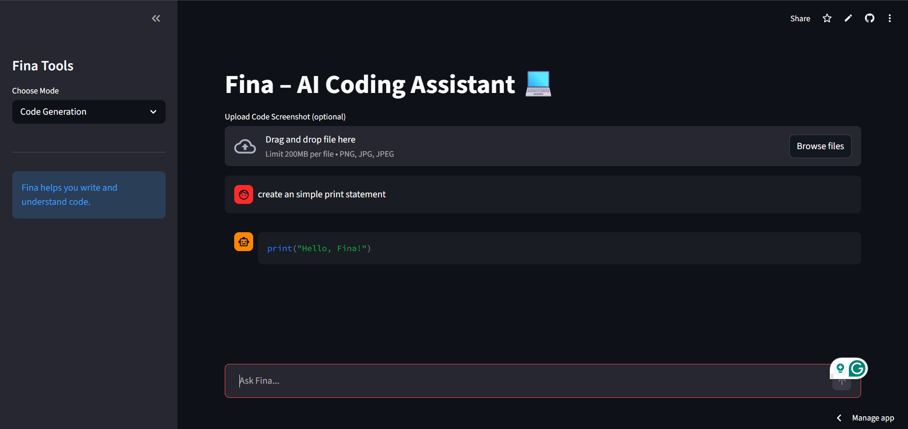
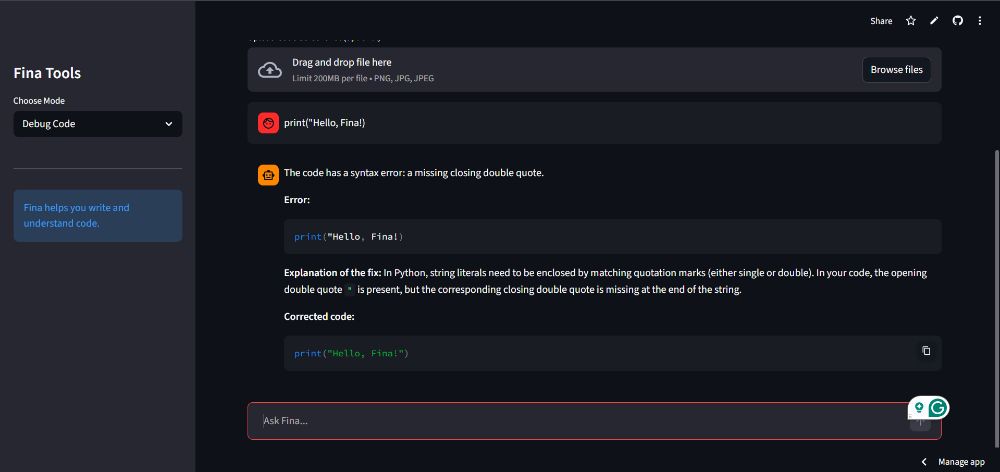
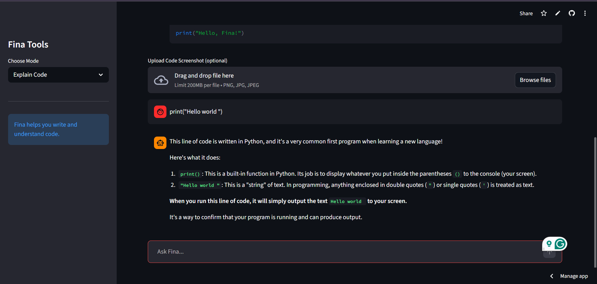
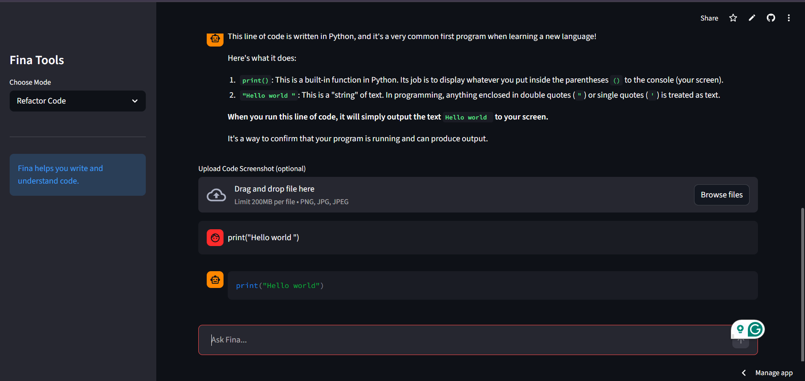

# FINA – AI Coding Assistant 💻

Fina is an AI-powered coding assistant built with **Streamlit** that helps developers write, debug, understand, and improve code efficiently.

The app provides multiple coding modes and supports both **text prompts and code screenshots** to assist developers in solving programming problems.

---

## Features 🚀

* **Code Generation**
  Generate clean and structured code with comments.

* **Debug Code**
  Identify errors and provide explanations for fixing them.

* **Explain Code**
  Understand complex code with simple explanations and examples.

* **Refactor Code**
  Improve code readability, performance, and structure.

* **Screenshot Support**
  Upload screenshots of code and get AI assistance.

* **Chat Interface**
  Interactive chat-style interface built using Streamlit.

---

## Tech Stack 🛠

* Python
* Streamlit
* Google Generative AI (Gemini API)
* Pillow
* python-dotenv

---

## Project Structure 📁

```
Fina_AIchatbox
│
├── main.py
├── requirements.txt
├── .gitignore
│
└── screenshots
     ├── code_generation.png
     ├── debug_code.png
     ├── explain_code.png
     └── refactor_code.png
```

---

## Application Preview 📸

### Code Generation



### Debug Code



### Explain Code



### Refactor Code



---

## APP URL

```
https://finaaichatbox.streamlit.app/
```

---

## Author 👩‍💻

**Fathima**

GitHub:
https://github.com/gousiafatima19

---


